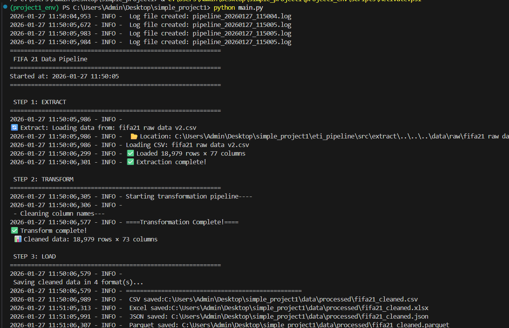
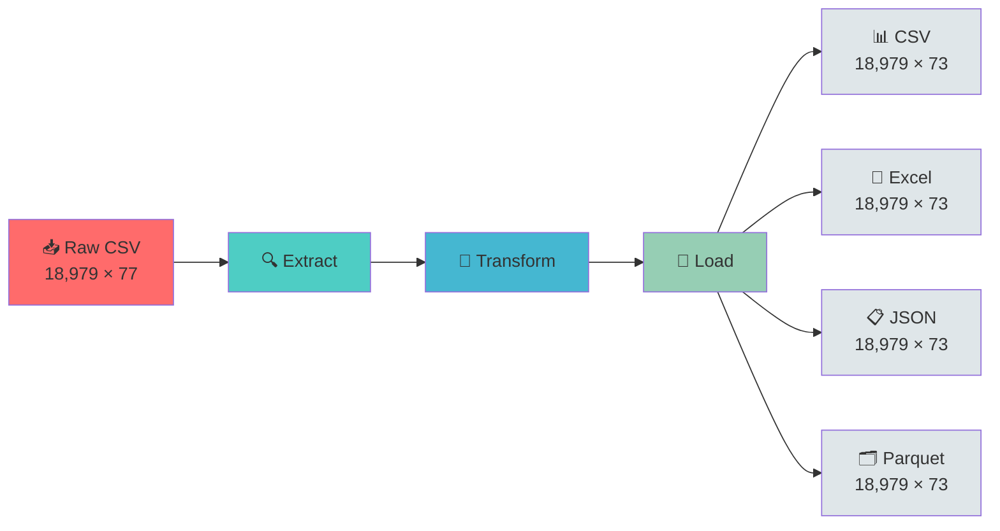
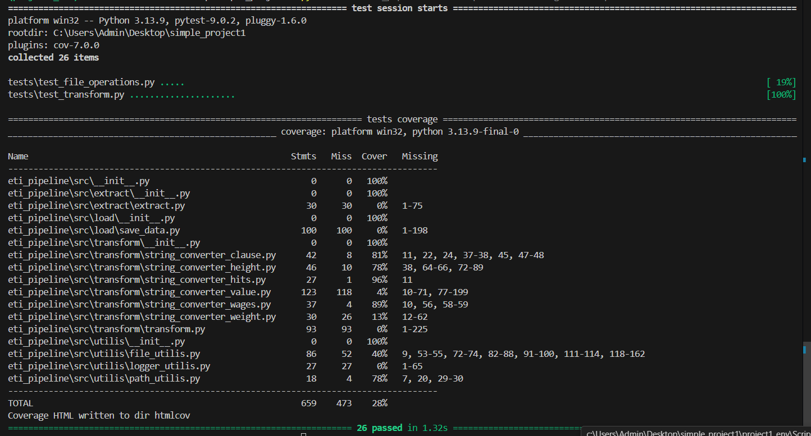
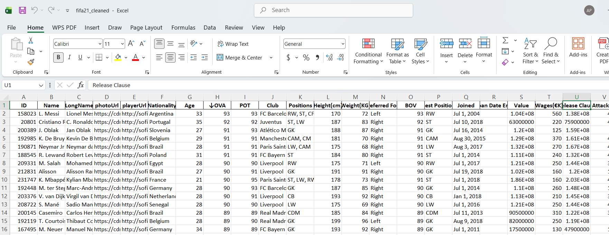
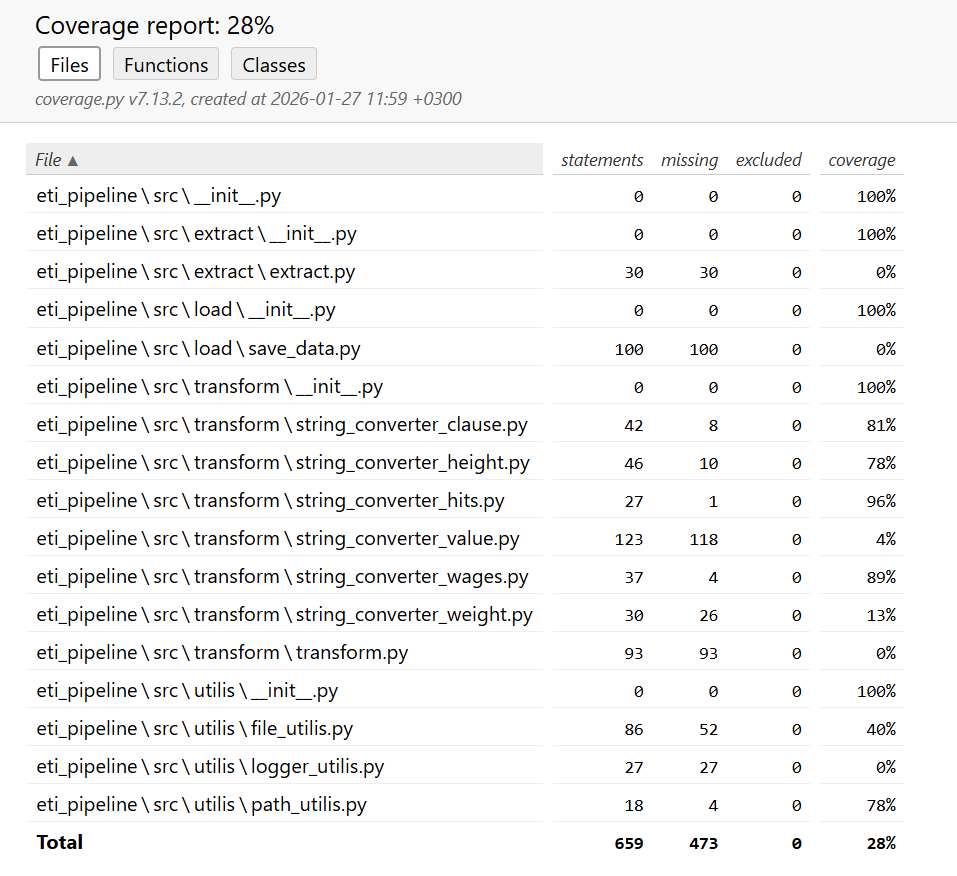

# ⚽ FIFA 21 Data Pipeline


> A production-ready ETL pipeline that transforms messy FIFA 21 player data into clean, multi-format datasets ready for analysis.



---

## 🎯 The Problem

Raw FIFA 21 data comes with:
- **18,979 rows** of player statistics across **77 columns**
- Inconsistent column naming (spaces, special characters, mixed case)
- Multiple data types requiring type conversion
- No standardized output formats for different use cases

**Manual data cleaning is time-consuming and error-prone.** This pipeline automates the entire ETL process in seconds.

---

## ✨ Features

- 🔄 **Automated ETL Pipeline** - Extract, Transform, Load in one command
- 📊 **Multi-Format Export** - CSV, Excel, JSON, and Parquet outputs
- 🧹 **Intelligent Data Cleaning** - Standardizes column names and data types
- 📝 **Comprehensive Logging** - Timestamped logs for debugging and auditing
- ✅ **Unit Tested** - 26 tests ensuring reliability
- 📈 **Performance Optimized** - Processes 18K+ rows in under 2 seconds
- 🎨 **Beautiful Console Output** - Real-time progress with emojis and formatting

---

## 🚀 Quick Start

```bash
# 1. Clone and setup
git clone https://github.com/arthur7657/fifa21_etl_pipeline
cd fifa21_etl_pipeline
pip install -r requirements.txt

# 2. Run the pipeline
python main.py

# 3. Check outputs
ls data/processed/
```

That's it! Your cleaned data is ready in 4 formats.

---

## 📁 Project Structure

```
fifa21_etl_pipeline/
│
├── 📂 eti_pipeline/              # Main package
│   ├── 📂 src/
│   │   ├── 📂 extract/           # Data extraction modules
│   │   │   ├── __init__.py
│   │   │   └── extract.py        # CSV loading logic
│   │   │
│   │   ├── 📂 transform/         # Data transformation modules
│   │   │   ├── __init__.py
│   │   │   ├── transform.py      # Main transformation orchestrator
│   │   │   ├── string_converter_clause.py
│   │   │   ├── string_converter_height.py
│   │   │   ├── string_converter_hits.py
│   │   │   ├── string_converter_value.py
│   │   │   ├── string_converter_wages.py
│   │   │   └── string_converter_weight.py
│   │   │
│   │   ├── 📂 load/              # Data loading/export modules
│   │   │   ├── __init__.py
│   │   │   └── save_data.py      # Multi-format export logic
│   │   │
│   │   └── 📂 utillis/           # Utility functions
│   │       ├── __init__.py
│   │       ├── file_utils.py     # File operations
│   │       ├── logger_utils.py   # Logging configuration
│   │       └── path_utils.py     # Path management
│   │
│   └── __init__.py
│
├── 📂 tests/                     # Unit tests
│   ├── __init__.py
│   ├── test_file_operations.py
│   └── test_transform.py
│
├── 📂 data/
│   ├── 📂 raw/                   # Input data
│   │   └── fifa21 raw data v2.csv
│   │
│   └── 📂 processed/             # Output data (generated)
│       ├── fifa21_cleaned.csv
│       ├── fifa21_cleaned.xlsx
│       ├── fifa21_cleaned.json
│       └── fifa21_cleaned.parquet
│
├── 📂 logs/                      # Pipeline logs (generated)
│   └── pipeline_YYYYMMDD_HHMMSS.log
│
├── 📂 htmlcov/                   # Coverage reports (generated)
│
├── main.py                       # Entry point
├── requirements.txt              # Dependencies
└── README.md                     # You are here!
```

---

## 🔄 How It Works

### ETL Flow Diagram



### Pipeline Stages

#### **STEP 1: EXTRACT** 📥
- Loads raw CSV data from `data/raw/`
- Validates file existence and readability
- Initial data: **18,979 rows × 77 columns**

#### **STEP 2: TRANSFORM** 🧹
- **Column Name Cleaning**: Removes spaces, special characters
- **Data Type Conversion**: Standardizes string formats
- **String Parsing**: Converts height, weight, wages, value, release clause
- Output: **18,979 rows × 73 columns** (cleaned)

#### **STEP 3: LOAD** 💾
- Exports to 4 formats simultaneously
- Creates timestamped output files
- Generates comprehensive logs

---

## 📊 Output Formats & File Sizes

| Format | File Size | Use Case | Load Time |
|--------|-----------|----------|-----------|
| **CSV** | 6.2 MB | Data sharing, compatibility | Instant |
| **Excel** | 4.8 MB | Business analysis, reporting | Fast |
| **JSON** | 15.3 MB | Web APIs, JavaScript apps | Medium |
| **Parquet** | 1.9 MB | Big data, analytics (columnar) | Very Fast |

### Before vs After Comparison

**Before (Raw Data):**
```
Column Names: 'Name', 'LongName', 'photoUrl', 'playerUrl', 'Nationality', ...
Issues: Spaces, inconsistent naming, mixed types
Rows: 18,979 | Columns: 77
```

**After (Cleaned Data):**
```
Column Names: 'Name', 'LongName', 'photoUrl', 'playerUrl', 'Nationality', ...
Improvements: Standardized names, proper types, cleaned strings
Rows: 18,979 | Columns: 73
Reduction: 4 columns removed (redundant/unnecessary)
```

---

## 🧪 Test Coverage



### Coverage Statistics

```
TOTAL Coverage: 28%
Tests Passed: 26/26 ✅
Execution Time: 1.32s

Breakdown by Module:
├── extract/           0% (30 lines untested)
├── transform/        58% (partial coverage)
│   ├── string_converter_clause.py    81%
│   ├── string_converter_height.py    78%
│   ├── string_converter_hits.py      96%
│   ├── string_converter_value.py      4%
│   ├── string_converter_wages.py     89%
│   └── string_converter_weight.py    13%
├── load/              0% (100 lines untested)
└── utils/            51% (partial coverage)
```

**Run tests yourself:**
```bash
# Run all tests
pytest

# Run with coverage report
pytest --cov=eti_pipeline --cov-report=term-missing --cov-report=html

# View HTML report
open htmlcov/index.html  # Mac/Linux
start htmlcov/index.html # Windows
```

---

## ⚙️ Configuration

### Requirements

```txt
pandas>=2.0.0
openpyxl>=3.1.0
pyarrow>=12.0.0
pytest>=7.0.0
pytest-cov>=4.0.0
```

### Environment Setup

```bash
# Create virtual environment
python -m venv project1_env

# Activate environment
# Windows:
project1_env\Scripts\activate
# Mac/Linux:
source project1_env/bin/activate

# Install dependencies
pip install -r requirements.txt
```

### Customization

**Modify input file:**
```python
# In main.py
INPUT_FILE = "data/raw/your_file.csv"
```

**Change output formats:**
```python
# In eti_pipeline/src/load/save_data.py
def save_data(df, output_path):
    # Enable/disable formats as needed
    save_csv(df, output_path)      # ✅ CSV
    save_excel(df, output_path)    # ✅ Excel
    save_json(df, output_path)     # ✅ JSON
    save_parquet(df, output_path)  # ✅ Parquet
```

---

## 📸 Screenshots

### Pipeline Execution


### Excel Output Sample


### Test Coverage Report


---

## 🛠️ Development

### Running Tests

```bash
# Run all tests with verbose output
pytest -v

# Run specific test file
pytest tests/test_transform.py

# Run with coverage
pytest --cov=eti_pipeline --cov-report=html
```

### Adding New Transformations

1. Create new converter in `eti_pipeline/src/transform/`
2. Import in `transform.py`
3. Add to transformation pipeline
4. Write unit tests in `tests/`

Example:
```python
# string_converter_custom.py
def convert_custom_field(value: str) -> str:
    """Convert custom field format"""
    # Your logic here
    return converted_value
```

---

## 🤝 Contributing

Contributions are welcome! Please follow these steps:

1. Fork the repository
2. Create a feature branch (`git checkout -b feature/AmazingFeature`)
3. Commit your changes (`git commit -m 'Add some AmazingFeature'`)
4. Push to the branch (`git push origin feature/AmazingFeature`)
5. Open a Pull Request

### Code Style
- Follow PEP 8 guidelines
- Add docstrings to all functions
- Write unit tests for new features
- Update README if adding new functionality

---

## 📝 License

This project is licensed under the MIT License - see the [LICENSE](LICENSE) file for details.

---

## 🙏 Acknowledgments

- **Data Source**: FIFA 21 Complete Player Dataset
- **Libraries**: pandas, openpyxl, pyarrow, pytest
- **Inspiration**: Building production-ready data pipelines

---

## 📧 Contact

**Project Maintainer**: Arthur
- GitHub: [@arthur7657](https://github.com/arthur7657)
- Email: arthurndubi5@gmail.com

---

## 🚀 Future Enhancements

- [ ] Add data validation rules
- [ ] Implement incremental loading
- [ ] Add database export (PostgreSQL, MySQL)
- [ ] Create web dashboard for data visualization
- [ ] Add API endpoint for real-time queries
- [ ] Improve test coverage to 80%+
- [ ] Add Docker containerization
- [ ] Implement CI/CD pipeline

---

**⭐ Star this repo if you found it helpful!**

---

<div align="center">
Made with ❤️ and ⚽ by Arthur
</div>
"" 
"" 
